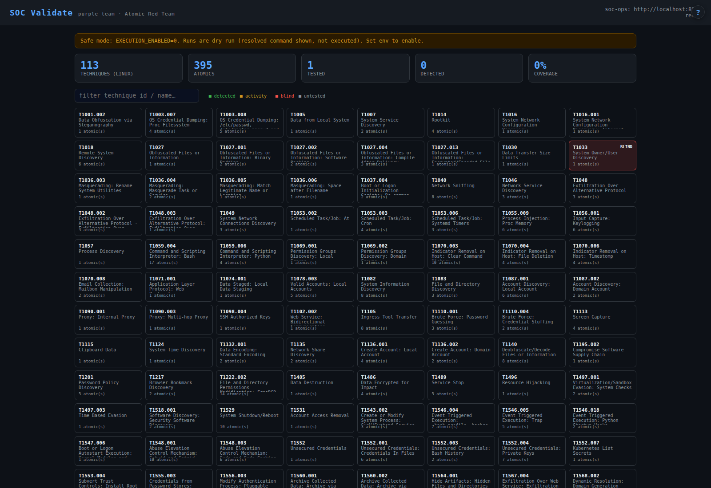

# soc-validate — purple-team detection validation

> Atomic Red Team detection-validation runner for blue teams — safe, execution-off by default, self-hosted.

<p align="center">
  
</p>


Closes the loop on the SOC: proves detections actually fire. Bundles **Atomic Red
Team**, runs an ATT&CK technique's Linux atomic, then asks **soc-ops** whether a
matching alert appeared → **PASS / ACTIVITY / BLIND**. Builds a coverage heatmap.

- **Atomics:** [redcanaryco/atomic-red-team](https://github.com/redcanaryco/atomic-red-team) submodule (MIT).
- **This app:** MIT, Python + PyYAML, port **:8104**. ~113 Linux techniques / ~395 atomics indexed.

## ⚠ Safety
Execution is **OFF by default** (`EXECUTION_ENABLED=0`) — runs are dry-run: the
resolved command is shown but **not** executed. To actually run atomics:
1. Set `EXECUTION_ENABLED=1` (env only, not in the committed unit), **and**
2. each run must pass `confirm=1`.

Only `sh`/`bash` Linux atomics ever execute. **Scope this to a lab endpoint** — it
runs real offensive commands. Do not point it at production.

## Verdicts
| Verdict | Meaning |
|---------|---------|
| **PASS** | soc-ops surfaced an alert referencing the technique id in the window |
| **ACTIVITY** | new alert(s) appeared but none matched the technique |
| **BLIND** | nothing detected — a coverage gap |
| **UNKNOWN** | soc-ops unreachable |
| **DRYRUN** | safe mode; command resolved, not executed |

## Run
```bash
git submodule update --init --depth 1
pip install -r requirements.txt
cp .env.example .env                 # set SOC_OPS_URL; leave EXECUTION_ENABLED=0 to start
python3 app.py                       # :8104
```

## Endpoints
| Path | Purpose |
|------|---------|
| `/` | heatmap dashboard |
| `/api/stats` | techniques, atomics, coverage %, exec flag |
| `/api/matrix?q=` | technique grid + last verdict |
| `/api/technique?id=T####` | atomics + resolved commands |
| `POST /api/run?id=&guid=&execute=&confirm=` | run/dry-run + detection check |
| `/health` | probe (soc-hub tile) |

## License
App: MIT. Atomic Red Team: MIT. No copyleft.


## Documentation

See **[MANUAL.md](MANUAL.md)** for the full manual (overview, configuration, endpoints, integration, troubleshooting). In the running dashboard, click the **`?` Help button** in the top-right corner to open it at `/manual`.
